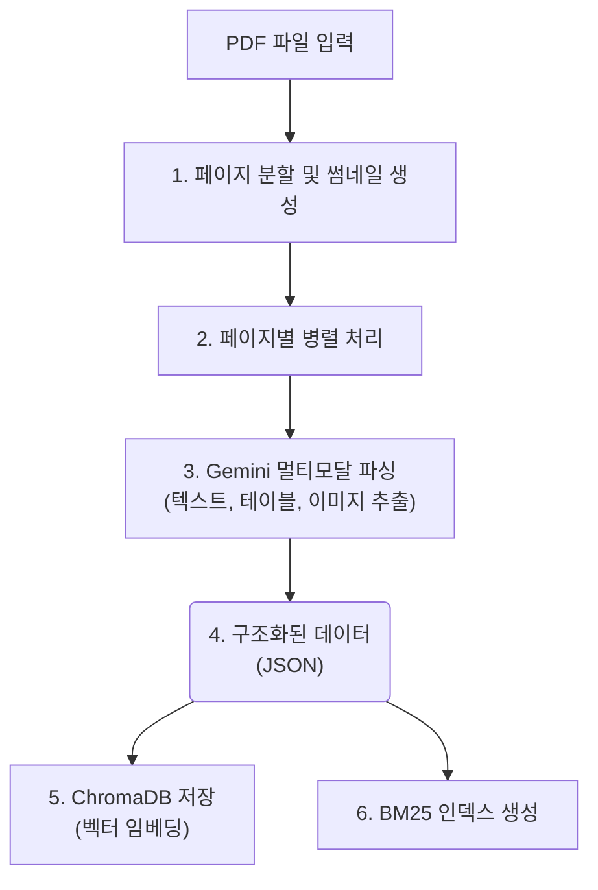
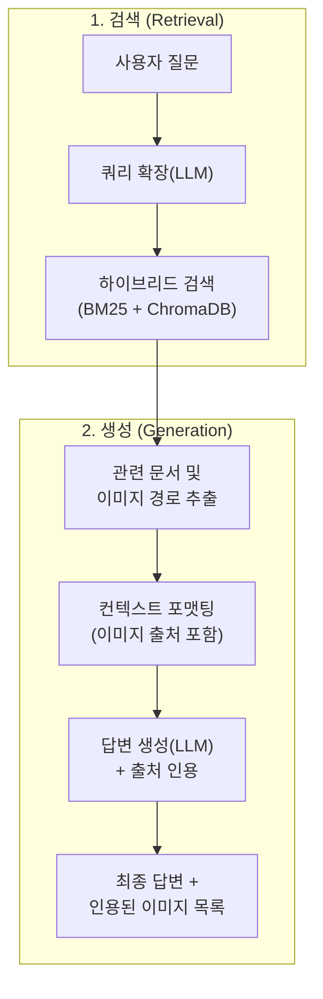

# Multimodal RAG for Technical Manuals

## 📖 프로젝트 개요 (Overview)

본 프로젝트는 복잡한 기술 매뉴얼(PDF 형식)을 위한 고급 멀티모달 RAG(Retrieval-Augmented Generation) 시스템입니다. Google Gemini Pro 멀티모달 모델을 활용하여 텍스트뿐만 아니라 문서 내의 이미지, 테이블까지 깊이 이해하고, 이를 바탕으로 사용자의 질문에 정확하게 답변합니다.

## ✨ 주요 기능 (Key Features)

- **멀티모달 문서 이해**: Gemini 모델을 통해 PDF 페이지의 텍스트, 테이블, 이미지를 동시에 분석하고 구조화된 JSON 데이터로 변환합니다.
- **하이브리드 검색 (Hybrid Search)**: 의미 기반의 벡터 검색(Dense)과 키워드 기반의 BM25 검색(Sparse)을 결합한 `EnsembleRetriever`를 사용하여 검색 정확도를 극대화합니다.
- **쿼리 확장 (Query Expansion)**: LLM을 사용하여 사용자의 질문을 검색에 최적화된 여러 키워드로 확장하여 관련성 높은 문서를 효과적으로 찾습니다.
- **정확한 출처 인용**: 답변 생성 시, LLM이 실제로 참고한 문서 페이지의 이미지를 정확히 식별하고 출처로 함께 제공합니다.
- **병렬 처리**: `ThreadPoolExecutor`를 활용하여 문서 처리(Ingestion) 과정을 병렬화하여 대용량 문서도 빠르게 처리할 수 있습니다.
- **CLI 기반 인터페이스**: `Typer`를 사용하여 문서 업로드(`ingest`)와 질의응답(`qa`) 기능을 편리하게 사용할 수 있습니다.

## 🏛️ 아키텍처 (Architecture)

### 데이터 수집 (Ingestion) 파이프라인


### 질의응답 (QA) 파이프라인


## 🛠️ 설치 (Installation)

1.  **Git 저장소 복제:**
    ```bash
    git clone https://github.com/your-username/Multimodal_RAG.git
    cd Multimodal_RAG
    ```

2.  **가상환경 생성 및 활성화:**
    ```bash
    python -m venv venv
    source venv/bin/activate  # macOS/Linux
    # venv\Scripts\activate    # Windows
    ```

3.  **의존성 패키지 설치:**
    ```bash
    pip install -r requirements.txt
    ```

4.  **환경 변수 설정:**
    `.env` 파일을 프로젝트 루트 디렉터리에 생성하고 Google API 키를 추가합니다.
    ```
    GOOGLE_API_KEY="여기에_당신의_API_키를_입력하세요"
    ```

## 🚀 사용법 (Usage)

### 1. 문서 처리 (Ingest)

`ingest` 명령어를 사용하여 PDF 문서를 데이터베이스에 추가합니다.

```bash
python main.py ingest "path/to/your/document.pdf"
```

-   `--workers` 옵션을 사용하여 동시에 처리할 스레드 수를 조절할 수 있습니다. (기본값: 50)
    ```bash
    python main.py ingest "path/to/your/document.pdf" --workers 10
    ```

### 2. 질의응답 (QA)

`qa` 명령어를 사용하여 데이터베이스에 저장된 문서에 대해 질문합니다.

```bash
python main.py qa "원점 복귀 방식에는 어떤 종류가 있나요?"
```

#### 실행 예시

```
$ python main.py qa "JOG 운전 속도를 설정하는 파라미터는 무엇인가요?"

질문: 'JOG 운전 속도를 설정하는 파라미터는 무엇인가요?'
Retriever를 준비 중입니다...
Retriever 준비 완료. 답변을 생성합니다...

---
답변:
JOG 운전 속도를 설정하는 파라미터는 Pr.7 "JOG 속도"입니다. 이 파라미터는 JOG 운전 시의 위치결정 속도를 설정하며, 단위는 [mm/min], [inch/min], [deg/min] 또는 [pulse]이고 설정 범위는 1~2000000000 입니다.

관련 이미지:
- assets/images/your_document_name_p123.png
---
```

## 📂 프로젝트 구조

```
/
├───.gitignore
├───main.py                 # CLI 애플리케이션 진입점
├───requirements.txt        # Python 의존성 목록
├───To_do_list.md           # 개발 작업 목록
├───assets/images/          # 생성된 썸네일 이미지 저장
├───chroma_db/              # ChromaDB 벡터 데이터베이스
├───data/                   # 입력 PDF 문서 및 생성된 BM25 인덱스
└───src/
    ├───parsing/
    │   ├───parser.py       # Gemini를 이용한 멀티모달 파서
    │   └───schema.py       # 파싱 데이터 구조(Pydantic 모델)
    ├───preprocessing/
    │   ├───loader.py       # PDF 문서 로더
    │   └───thumbnail.py    # 페이지 썸네일 생성기
    ├───retrieval/
    │   ├───generator.py    # RAG 답변 및 인용 생성
    │   ├───query_expansion.py # 쿼리 확장 모듈
    │   └───retriever.py    # 하이브리드 검색기(EnsembleRetriever)
    └───storage/
        └───vector_db.py    # ChromaDB 인터페이스
```
