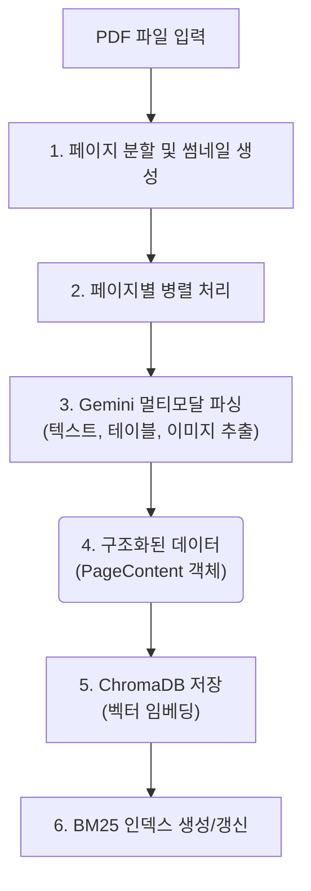
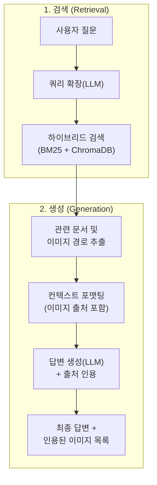

# Multimodal RAG for Technical Manuals

## 📖 프로젝트 개요 (Overview)

본 프로젝트는 복잡한 기술 매뉴얼(PDF 형식)을 위한 고급 멀티모달 RAG(Retrieval-Augmented Generation) 시스템입니다. Google Gemini Pro 멀티모달 모델을 활용하여 텍스트뿐만 아니라 문서 내의 이미지, 테이블까지 깊이 이해하고, 이를 바탕으로 사용자의 질문에 정확하게 답변합니다.

## ✨ 주요 기능 (Key Features)

- **멀티모달 문서 이해**: Gemini 모델을 통해 PDF 페이지의 텍스트, 테이블, 이미지를 동시에 분석하고 구조화된 데이터(`Pydantic` 모델)로 변환합니다.
- **하이브리드 검색 (Hybrid Search)**: 의미 기반의 벡터 검색(Dense)과 키워드 기반의 BM25 검색(Sparse)을 결합한 `EnsembleRetriever`를 사용하여 검색 정확도를 극대화합니다.
- **쿼리 확장 (Query Expansion)**: LLM을 사용하여 사용자의 질문을 검색에 최적화된 여러 키워드로 확장하여 관련성 높은 문서를 효과적으로 찾습니다.
- **정확한 출처 인용**: 답변 생성 시, LLM이 실제로 참고한 문서 페이지의 이미지를 정확히 식별하고 출처로 함께 제공합니다.
- **병렬 처리**: `ThreadPoolExecutor`를 활용하여 문서 처리(Ingestion) 과정을 병렬화하여 대용량 문서도 빠르게 처리할 수 있습니다.
- **CLI 기반 인터페이스**: `Typer`를 사용하여 문서 업로드(`ingest`)와 질의응답(`qa`) 기능을 편리하게 사용할 수 있습니다.

## 🏛️ 아키텍처 (Architecture)

### 데이터 수집 (Ingestion) 파이프라인


### 질의응답 (QA) 파이프라인


## 🛠️ 설치 (Installation)

1.  **Git 저장소 복제:**
    ```bash
    git clone https://github.com/your-username/Multimodal_RAG.git
    cd Multimodal_RAG
    ```

2.  **Poetry를 사용하여 의존성 패키지 설치:**
    *Poetry가 설치되어 있어야 합니다.*
    ```bash
    poetry install
    ```

3.  **가상환경 활성화:**
    ```bash
    poetry shell
    ```

4.  **환경 변수 설정:**
    `.env` 파일을 프로젝트 루트 디렉터리에 생성하고 Google API 키를 추가합니다. `src/config.py`의 `Settings` 클래스를 참고하세요.
    ```
    GOOGLE_API_KEY="YOUR_API_KEY_HERE"
    ```

## 🚀 사용법 (Usage)

본 프로젝트는 CLI와 API 두 가지 인터페이스를 제공합니다.

### 1. CLI (명령줄 인터페이스)

`typer`로 구현된 CLI를 통해 문서를 처리하거나 질문할 수 있습니다.

#### 문서 처리 (Ingest)

`ingest` 명령어를 사용하여 PDF 문서를 데이터베이스에 추가합니다.
```bash
python main.py ingest "path/to/your/document.pdf"
```

#### 질의응답 (QA)

`qa` 명령어를 사용하여 데이터베이스에 저장된 문서에 대해 질문합니다.
```bash
python main.py qa "원점 복귀 방식에는 어떤 종류가 있나요?"
```

### 2. API (FastAPI)

`fastapi`로 구현된 API 서버를 실행하여 HTTP를 통해 RAG 파이프라인을 사용할 수 있습니다.

#### API 서버 실행

Uvicorn을 사용하여 API 서버를 시작합니다.
```bash
uvicorn src.api.main:app --reload
```
서버가 실행되면 브라우저에서 `http://127.0.0.1:8000/docs` 로 접속하여 API 문서를 확인할 수 있습니다.


## 📂 프로젝트 구조

```
/
├───main.py                 # Typer CLI 애플리케이션 진입점
├───pyproject.toml          # Poetry 의존성 및 프로젝트 설정
├───.env                    # 환경 변수 파일 (API 키 등)
├───assets/images/          # 문서 페이지별 썸네일 이미지 저장
├───chroma_db/              # ChromaDB 벡터 데이터베이스
├───data/                   # BM25 인덱스 등
├───src/
│   ├───config.py           # Pydantic을 이용한 중앙 설정 관리
│   ├───api/                # FastAPI 애플리케이션
│   │   ├───main.py         # API 서버 진입점
│   │   ├───routes.py       # API 라우트 정의
│   │   └───schemas.py      # API 요청/응답 스키마
│   └───rag_pipeline/       # 핵심 RAG 파이프라인 모듈
│       ├───generator.py    # 답변 생성 모듈
│       ├───loader.py       # 문서 로더
│       ├───parser.py       # 멀티모달 파서
│       ├───query_expansion.py # 쿼리 확장 모듈
│       ├───retriever.py    # 하이브리드 검색기
│       ├───schema.py       # 데이터 구조 (Pydantic 모델)
│       ├───thumbnail.py    # 썸네일 생성기
│       └───vector_db.py    # ChromaDB 인터페이스
└───tests/                  # 테스트 코드
```

