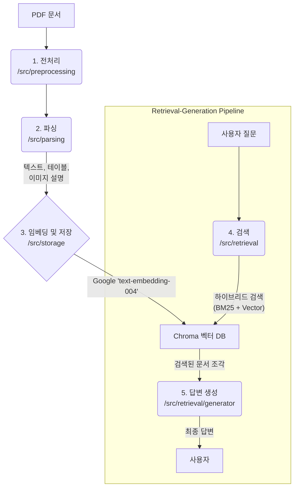

# Multimodal RAG 시스템 설계 문서

## 1. 개요

이 문서는 PDF 문서 기반의 멀티모달(Multimodal) 질의응답(RAG) 시스템의 아키텍처와 구성 요소, 데이터 흐름을 상세히 설명합니다.

본 시스템의 주요 목적은 텍스트와 이미지가 혼합된 PDF 문서의 내용을 이해하고, 사용자의 질문에 대해 문서 기반의 정확한 답변을 생성하는 것입니다. 이를 위해 이미지 내용은 텍스트 설명으로 변환되며, 모든 정보는 텍스트 기반으로 임베딩 및 검색됩니다.

## 2. 시스템 아키텍처

아래 다이어그램은 전체 시스템의 데이터 흐름과 주요 구성 요소 간의 상호작용을 보여줍니다.



## 3. 주요 구성 요소

### 3.1. 데이터 전처리 (`src/preprocessing`)

-   **역할**: 입력된 PDF 문서를 처리 가능한 형태로 준비하는 단계입니다.
-   **주요 모듈**:
    -   `loader.py`: PDF 파일을 로드하여 페이지별로 분리합니다.
    -   `thumbnail.py`: 문서의 각 페이지에 대한 썸네일 이미지를 생성하여 시각적 참조 자료로 활용합니다.

### 3.2. 콘텐츠 파싱 (`src/parsing`)

-   **역할**: 전처리된 각 페이지에서 의미있는 정보를 추출하고 구조화합니다.
-   **주요 모듈**:
    -   `parser.py`: 페이지 내에서 텍스트, 표(table)를 추출합니다.
    -   **핵심 로직**: 페이지 내 이미지를 인식하고, 이에 대한 **텍스트 설명을 생성**합니다. 이 과정을 통해 시각적 정보(이미지)가 검색 가능한 텍스트 정보로 변환됩니다.
    -   `schema.py`: 파싱된 데이터(텍스트, 테이블, 이미지 설명, 키워드, 요약 등)를 담는 Pydantic 데이터 모델을 정의합니다.

### 3.3. 스토리지 및 임베딩 (`src/storage`)

-   **역할**: 파싱된 텍스트 데이터를 벡터로 변환하고, 이를 검색할 수 있도록 데이터베이스에 저장합니다.
-   **주요 모듈**:
    -   `vector_db.py`:
        1.  **임베딩**: Google의 `text-embedding-004` 모델을 사용하여 텍스트, 테이블, 이미지 설명 등 모든 텍스트 정보를 벡터(Embedding)로 변환합니다.
        2.  **저장**: 생성된 벡터를 메타데이터(페이지 번호, 콘텐츠 타입 등)와 함께 `Chroma DB`에 저장합니다.

### 3.4. 검색 (`src/retrieval`)

-   **역할**: 사용자 질문과 가장 관련성이 높은 문서 조각(chunks)을 데이터베이스에서 찾아내는 단계입니다.
-   **주요 모듈**:
    -   `retriever.py`: **하이브리드 검색(Hybrid Search)** 방식을 사용하여 검색 정확도를 높입니다.
        -   **Vector Search**: 의미론적으로 유사한 콘텐츠를 찾습니다. (예: "자동차 그림" -> "승용차 이미지 설명")
        -   **BM25**: 키워드 일치 기반으로 정확한 용어를 찾습니다. 한국어 형태소 분석기(`konlpy`)를 사용하여 조사, 어미 등을 처리하고 검색 성능을 향상시킵니다.
        -   `EnsembleRetriever`를 사용해 위 두 방식의 결과를 결합합니다.
    -   `query_expansion.py`: 사용자의 원본 질문을 다양한 형태로 확장하여 검색 성능을 보강합니다.

### 3.5. 답변 생성 (`src/retrieval/generator.py`)

-   **역할**: 검색된 문서 조각과 사용자 질문을 바탕으로 최종 답변을 생성합니다.
-   **로직**:
    1.  `retriever`가 찾은 관련성 높은 문서 조각들을 컨텍스트(Context)로 구성합니다.
    2.  이 컨텍스트와 원본 질문을 프롬프트(Prompt)로 조합합니다.
    3.  조합된 프롬프트를 Google Gemini와 같은 대규모 언어 모델(LLM)에 전달하여 자연스러운 형태의 최종 답변을 생성하도록 요청합니다.

## 4. 기술 스택

-   **코어 프레임워크**: `LangChain`
-   **임베딩 모델**: Google `text-embedding-004`
-   **생성 모델**: Google `Gemini` 계열 모델 (추정)
-   **벡터 데이터베이스**: `ChromaDB`
-   **한국어 자연어 처리**: `konlpy` (Okt 형태소 분석기)
-   **환경변수 관리**: `python-dotenv`

## 5. 환경 설정 및 실행

-   **API 키**: 프로젝트 루트 디렉토리에 `.env` 파일을 생성하고 `GOOGLE_API_KEY`를 설정해야 합니다.
    ```
    GOOGLE_API_KEY="YOUR_API_KEY_HERE"
    ```
-   **실행**: `main.py`는 위에서 설명한 모든 구성 요소를 통합하여 전체 RAG 파이프라인을 실행하는 진입점(entry point) 역할을 합니다.
