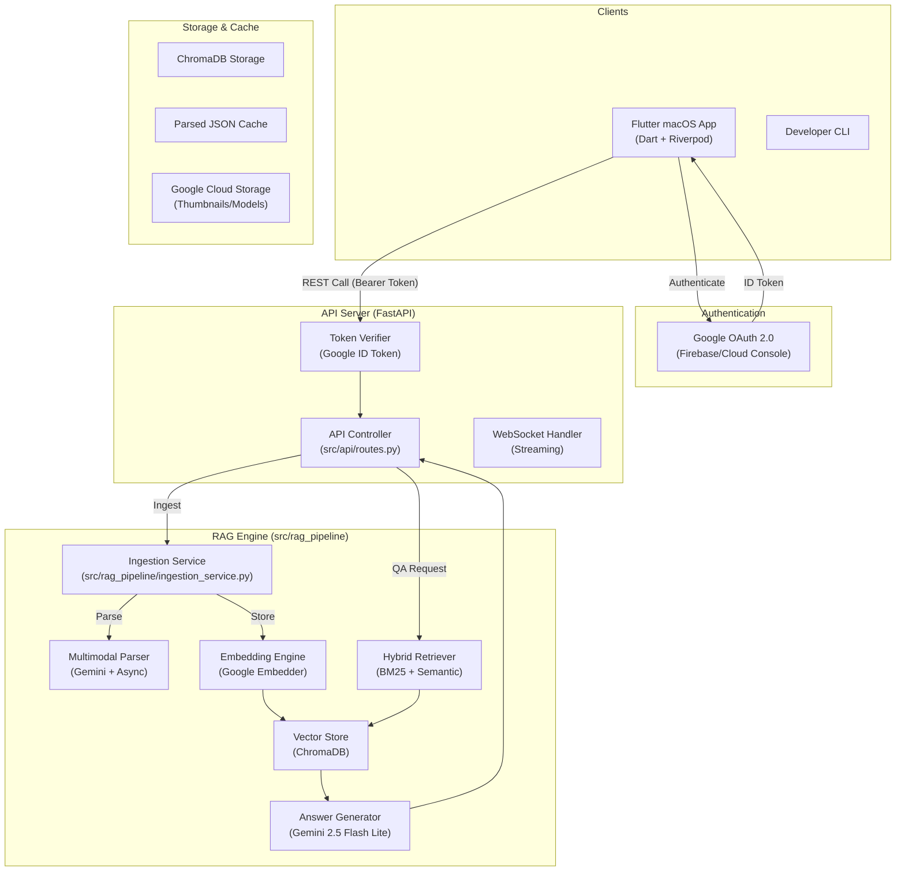

# Multimodal RAG 시스템 설계 문서 (v2.0 Architecture)

## 1. 개요

본 문서는 PDF 매뉴얼 기반의 멀티모달 질의응답 시스템의 아키텍처를 정의합니다.
v2.0에서는 **성능 최적화(병렬 처리)**, **품질 평가(Ragas)**, **사용자 피드백 루프**가 통합되었습니다.

## 2. 시스템 아키텍처 (Architecure Overview)

```mermaid
graph TD
    subgraph Clients ["Clients"]
        App["Flutter macOS App<br>(Dart + Riverpod)"]
        CLI["Developer CLI"]
    end

    subgraph Auth ["Authentication"]
        GoogleOAuth["Google OAuth 2.0<br>(Firebase/Cloud Console)"]
    end

    subgraph APIGateway ["API Server (FastAPI)"]
        Verify["Token Verifier<br>(Google ID Token)"]
        API["API Controller<br>(src/api/routes.py)"]
        WS["WebSocket Handler<br>(Streaming)"]
    end

    subgraph RAGEngine ["RAG Engine (src/rag_pipeline)"]
        Parser["Multimodal Parser<br>(Gemini + Async)"]
        Ingestion["Ingestion Service<br>(src/rag_pipeline/ingestion_service.py)"]
        Embed["Embedding Engine<br>(Google Embedder)"]
        VectorDB["Vector Store<br>(ChromaDB)"]
        Retriever["Hybrid Retriever<br>(BM25 + Semantic)"]
        Generator["Answer Generator<br>(Gemini 2.5 Flash Lite)"]
    end

    subgraph Storage ["Storage & Cache"]
        VectorDB_Files["ChromaDB Storage"]
        ParsedJSON["Parsed JSON Cache"]
        GCS["Google Cloud Storage<br>(Thumbnails/Models)"]
    end

    %% Flow
    App -- "Authenticate" --> GoogleOAuth
    GoogleOAuth -- "ID Token" --> App
    App -- "REST Call (Bearer Token)" --> Verify
    Verify --> API
    
    API -- "Ingest" --> Ingestion
    Ingestion -- "Parse" --> Parser
    Ingestion -- "Store" --> Embed --> VectorDB
    
    API -- "QA Request" --> Retriever
    Retriever --> VectorDB --> Generator
    Generator --> API
```

## 3. 핵심 모듈 상세 (Key Components)

### 3.1. Flutter Frontend (`frontend/`)

* **State Management (Riverpod)**: `Riverpod Generator`를 사용하여 로직과 UI를 분리하고, `keepAlive` 설정을 통해 탭 전환 시에도 실시간 데이터를 보존합니다.
* **Navigation (GoRouter)**: `StatefulShellRoute`를 구현하여 각 탭(채팅, 라이브러리, 설정)의 네비게이션 상태와 위젯 트리를 개별적으로 유지합니다.
* **Auth Integration**: `google_sign_in` 패키지를 통해 macOS 키체인과 연동된 안전한 인증 플로우를 제공합니다.

### 3.2. RAG 파이프라인 (`src/rag_pipeline`)

* **`ingestion_service.py` [New]**: `main.py`에 산재해 있던 PDF 로드, 썸네일 생성, 페이지별 파싱 후 벡터 DB 적재 로직을 총괄하는 서비스입니다. 병렬 처리를 캡슐화하여 CLI와 API 모두에서 동일한 로직을 사용할 수 있게 합니다.
* **`parser.py`**: 비동기(`asyncio`) 병렬 처리를 통해 PDF를 고속 파싱합니다. Gemini를 사용하여 텍스트, 표, 이미지 설명 및 **문서 제목**을 추출합니다. **로컬 JSON 캐싱 시스템**을 통해 중복 처리 비용을 제거합니다.
* **`vector_db.py`**: Google의 `gemini-embedding-001` 모델을 사용하여 임베딩을 수행합니다. 추출된 제목과 메타데이터(페이지 번호, 일시 등)를 포함하여 ChromaDB에 저장합니다.
* **`retriever.py`**: 문서명을 기준으로 검색 범위를 한정하는 **필터링 기능**이 추가된 하이브리드 검색기입니다. **BM25 알고리즘에 `konlpy (Okt)` 형태소 분석기**를 통합하여 한국어 기술 용어 검색 정확도를 극대화했습니다.
* **`generator.py`**: 검색된 컨텍스트와 이미지를 종합하여 정확한 답변을 생성하며, 이미지 출처를 명시합니다. **스마트 페이지 라우팅** 기능을 통해 특정 페이지에 대한 질의 시 정확도를 비약적으로 향상시켰습니다.

### 3.2. API 서버 (`src/api`)

* **`routes.py`**:
  * `/ingest`: 백그라운드 태스크로 대용량 문서를 처리하며 진행률을 추적합니다. **중복 업로드 방지 로직**과 `force` 옵션을 지원합니다.
  * `/qa`: `trace_id`를 발급하고 답변을 반환합니다.
  * `/feedback`: 사용자의 피드백을 수집하여 로그에 저장합니다.
  * `/documents`: 인덱싱된 문서 목록과 추출된 제목을 반환합니다.
* **`logs.py`**: 모든 QA 상호작용과 피드백을 JSONL 파일로 기록하여 추후 분석 및 파인튜닝 데이터로 활용합니다.

### 3.3. 평가 및 테스트 (`tests/`)

* **`evaluation/run_eval.py`**: Ragas 프레임워크를 사용하여 Faithfulness, Answer Relevancy 등을 정량 평가합니다.
* **`api/`**: 전체 시스템 엔드포인트에 대한 통합 테스트를 수행합니다.

## 4. 데이터 흐름 (Data Flow)

1. **문서 등록**: PDF 업로드 -> 비동기 파싱 -> 제목/내용 추출 -> 임베딩 -> ChromaDB 저장.
2. **질의 응답**: 사용자 질문 -> 쿼리 확장 -> **스마트 라우팅(페이지 번호 추출)** -> (필터링) -> 하이브리드 검색 -> 답변 생성 -> `trace_id` 발급 -> 응답.
3. **피드백**: 사용자 피드백(좋아요/싫어요) -> `/feedback` -> `trace_id` 매핑 -> 로그 저장.
