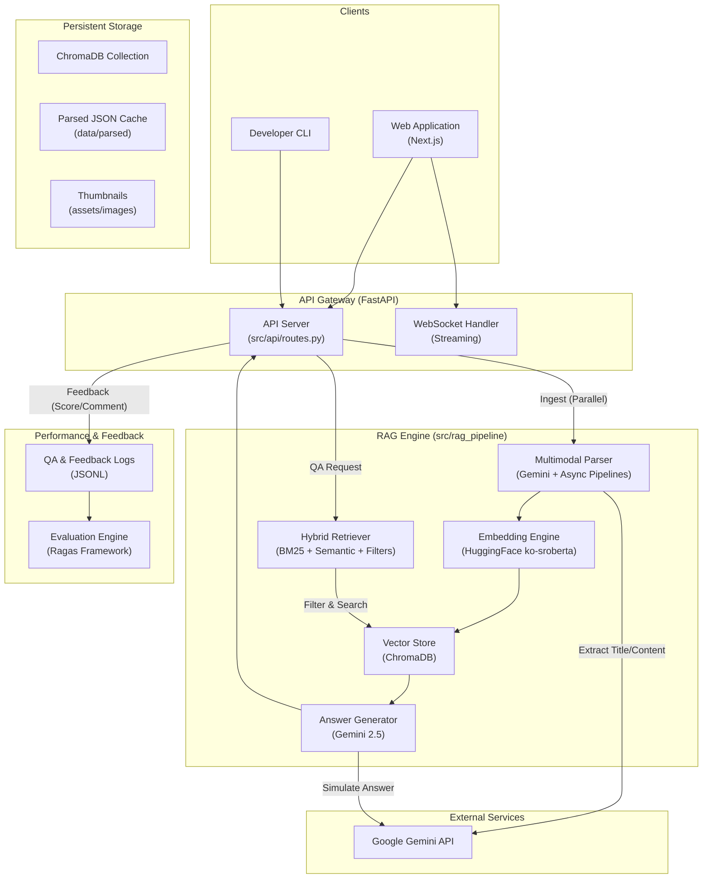

# Multimodal RAG 시스템 설계 문서 (v2.0 Architecture)

## 1. 개요

본 문서는 PDF 매뉴얼 기반의 멀티모달 질의응답 시스템의 아키텍처를 정의합니다.
v2.0에서는 **성능 최적화(병렬 처리)**, **품질 평가(Ragas)**, **사용자 피드백 루프**가 통합되었습니다.

## 2. 시스템 아키텍처 (Architecure Overview)

## 3. 핵심 모듈 상세 (Key Components)

### 3.1. RAG 파이프라인 (`src/rag_pipeline`)

* **`parser.py`**: 비동기(`asyncio`) 병렬 처리를 통해 PDF를 고속 파싱합니다. Gemini를 사용하여 텍스트, 표, 이미지 설명 및 **문서 제목**을 추출합니다. **로컬 JSON 캐싱 시스템**을 통해 중복 처리 비용을 제거합니다.
* **`vector_db.py`**: `jhgan/ko-sroberta-multitask` 모델을 사용하여 로컬 임베딩을 수행합니다. 추출된 제목과 메타데이터(페이지 번호, 일시 등)를 포함하여 ChromaDB에 저장합니다.
* **`retriever.py`**: 문서명을 기준으로 검색 범위를 한정하는 **필터링 기능**이 추가된 하이브리드 검색기입니다. **BM25 알고리즘에 `konlpy (Okt)` 형태소 분석기**를 통합하여 한국어 기술 용어 검색 정확도를 극대화했습니다.
* **`generator.py`**: 검색된 컨텍스트와 이미지를 종합하여 정확한 답변을 생성하며, 이미지 출처를 명시합니다. **스마트 컨텍스트 확장** 기능 및 **스마트 페이지 라우팅(페이지 번호 자동 추출 쿼리 필터링)** 기능을 통해 특정 페이지에 대한 질의 시 정확도를 비약적으로 향상시켰습니다.

### 3.2. API 서버 (`src/api`)

* **`routes.py`**:
  * `/ingest`: 백그라운드 태스크로 대용량 문서를 처리하며 진행률을 추적합니다. **중복 업로드 방지 로직**과 `force` 옵션을 지원합니다.
  * `/qa`: `trace_id`를 발급하고 답변을 반환합니다.
  * `/feedback`: 사용자의 피드백을 수집하여 로그에 저장합니다.
  * `/documents`: 인덱싱된 문서 목록과 추출된 제목을 반환합니다.
* **`logs.py`**: 모든 QA 상호작용과 피드백을 JSONL 파일로 기록하여 추후 분석 및 파인튜닝 데이터로 활용합니다.

### 3.3. 평가 및 테스트 (`tests/`)

* **`evaluation/run_eval.py`**: Ragas 프레임워크를 사용하여 Faithfulness, Answer Relevancy 등을 정량 평가합니다.
* **`api/`**: 전체 시스템 엔드포인트에 대한 통합 테스트를 수행합니다.

## 4. 데이터 흐름 (Data Flow)

1. **문서 등록**: PDF 업로드 -> 비동기 파싱 -> 제목/내용 추출 -> 임베딩 -> ChromaDB 저장.
2. **질의 응답**: 사용자 질문 -> 쿼리 확장 -> **스마트 라우팅(페이지 번호 추출)** -> (필터링) -> 하이브리드 검색 -> 답변 생성 -> `trace_id` 발급 -> 응답.
3. **피드백**: 사용자 피드백(좋아요/싫어요) -> `/feedback` -> `trace_id` 매핑 -> 로그 저장.
