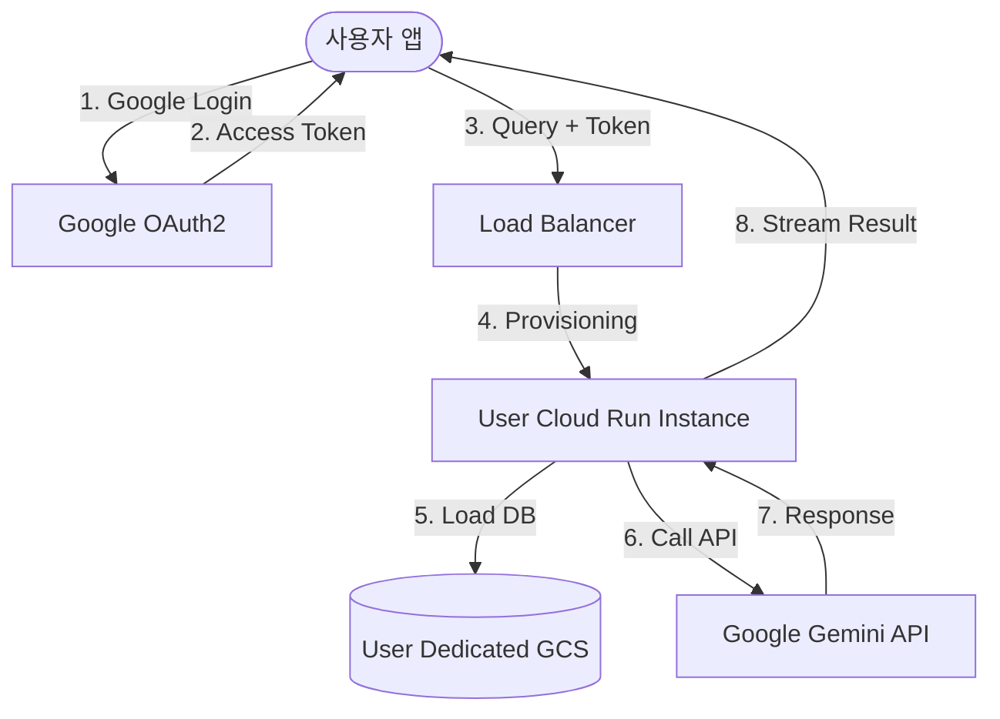

# 🚀 Multimodal RAG Personal Assistant: 통합 설계 및 로드맵

## 1. 프로젝트 비전 (Project Vision)
본 프로젝트는 **"누구나 자신의 데이터를 활용해 최고의 성능으로, 비용 부담 없이 이용할 수 있는 개인화 AI 비서"**를 지향합니다. 사용자는 복잡한 API 키 발급 없이 구글 로그인만으로 멀티플랫폼(Mobile/Desktop) 환경에서 자신의 문서를 학습시키고 대화할 수 있습니다.

---

## 2. 핵심 아키텍처 (Key Architecture)

### 2.1 분산형 마이크로 백엔드 (Scalable Cloud)
- **개념**: 중앙 집중식 서버 대신, 사용자 요청 발생 시점에 전용 인스턴스(Google Cloud Run)를 생성하여 처리합니다.
- **이점**:
    - **무한 확장**: 사용자 증가에 따른 서버 부하 문제를 근본적으로 해결합니다.
    - **격리된 자원**: 각 사용자의 연산 자원이 분리되어 성능 간섭이 없습니다.
    - **비용 최적화**: 사용하지 않을 때는 인스턴스가 0으로 수렴하여 서버 비용이 거의 발생하지 않습니다.

### 2.2 Keyless 인증 시스템 (OAuth2 Integration)
- **개념**: 사용자가 API 키를 직접 관리하는 대신, 구글 로그인을 통해 발급받은 `Access Token`을 사용하여 본인의 구글 클라우드 자원을 활용합니다.
- **이점**:
    - **심리스한 UX**: 로그인 한 번으로 모든 기능이 즉각 활성화됩니다.
    - **무료 이용**: 구글이 제공하는 사용자별 무료 API 할당량을 자동으로 활용합니다.

### 2.3 독립적 데이터 스토리지 (Isolated DB)
- **Vector DB**: 각 유저의 벡터 인덱스는 Google Cloud Storage(GCS)에 유저별 고유 경로로 분리 저장됩니다.
- **File Storage**: 원본 PDF 및 썸네일 역시 유저별 전용 버킷 경로에 보관되어 데이터 보안을 극대화합니다.

---

## 3. 기능 명세 (Feature Specifications)

### 3.1 개인화 및 문맥 관리
- **어시스턴트 페르소나**: 사용자의 직업, 관심사, 지시 사항을 반영하여 답변의 톤과 매너를 개인화합니다.
- **대화 내역(Chat History)**: 이전 대화를 기억하여 문맥에 맞는 정교한 답변을 제공합니다.
- **RAG & 일반 대화**: 문서 기반 답변뿐만 아니라, 다양한 개발 지원 및 일상 대화도 가능합니다.

### 3.2 멀티모달 서비스
- **이미지 인용**: 답변의 근거가 되는 문서의 페이지를 썸네일로 직접 보여주어 가독성을 높입니다.
- **멀티플랫폼**: Flutter를 사용하여 macOS, Windows, iOS, Android 등 모든 플랫폼에서 동일한 경험을 제공합니다.

---

## 4. 로드맵 (Roadmap)

### Phase 1: 기반 시스템 구축 (진행 완료)
- [x] 멀티모달 RAG 파이프라인 (파싱, 임베딩, 검색) 완성
- [x] WebSocket 기반 실시간 스트리밍 답변 구현
- [x] 리버팟(Riverpod) 기반 크로스 플랫폼 프론트엔드 기초 구축
- [x] 대화 문맥 및 기본 프로필 연동 로직 구현

### Phase 2: 클라우드 및 인증 고도화 (Next Steps)
- [ ] **구글 소셜 로그인**: OAuth2 연동 및 유저 고유 ID 추출
- [ ] **GCS 통합**: 로컬 DB를 GCS 기반의 유저별 분산 DB로 전환
- [ ] **Cloud Run 배포**: 도커 이미지 최적화 및 서버리스 환경 구성

### Phase 3: UX 및 서비스 최적화
- [ ] **Keyless UX**: API 키 입력창 제거 및 자동 토큰 연동
- [ ] **설정 최적화**: 유저가 직접 자신의 페르소나와 무드(Tone)를 설정하는 UI 추가

---

## 5. 아키텍처 다이어그램 (Workflow)

---
**최종 업데이트**: 2026-02-04
**설계자**: Bonggoo & Antigravity Pair
