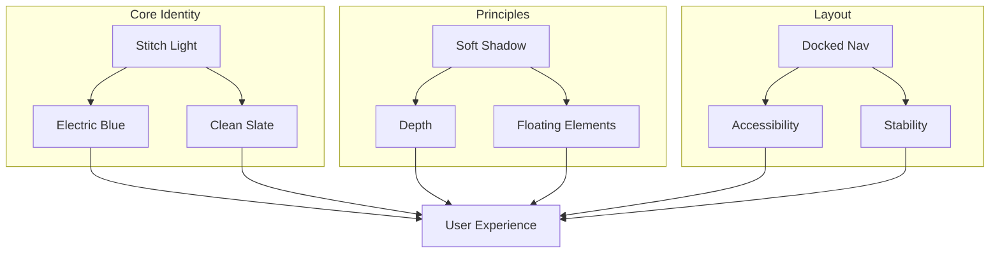

# 💎 Design Identity & Rules: [Stitch Light]

사용자님의 프로젝트를 위한 **Stitch Light** 프리미엄 디자인 가이드라인입니다.

## 1. Color Palette (Clean & Airy Light Mode)
밝고 현대적인 **Electric Blue**와 **Clean Slate** 컬러를 사용하여 전문적인 SaaS 느낌을 줍니다.
- **Primary**: `#135bec` (Electric Blue) - 신뢰감과 에너지를 주는 메인 컬러
- **Background**: `#F8FAFC` (Slate-50) - 차분하고 전문적인 밝은 배경
- **Surface**: `#FFFFFF` (White) - 카드 및 컨테이너 배경
- **Text Primary**: `#1E293B` (Slate-800) - 높은 가독성의 짙은 텍스트
- **Text Secondary**: `#64748B` (Slate-500) - 보조 설명용
- **Border**: `#E2E8F0` (Slate-200) - 은은한 구분선

## 2. UI/UX Core Principles
- **Soft Shadows**: iOS 스타일의 부드러운 그림자(`box-shadow`)를 사용하여 깊이감을 표현합니다.
- **Rounded Corners**: `BorderRadius.circular(20)` 이상을 사용하여 친근하고 현대적인 느낌을 줍니다.
- **Glassmorphism (Light)**: 밝은 배경 위에서 흐릿한 투명 효과(`backdrop-filter`)를 세련되게 사용합니다.

## 3. Typography
- **Main Font**: `Inter` 또는 `Outfit` - 기하학적이고 현대적인 산세리프체
- **Hierarchy**:
  - `H1 (Healine)`: Bold, Size 24~32
  - `Body`: Medium/Regular, Size 14~16
  - `Caption`: Regular, Size 12, Slate-500

## 4. Navigation & Layout
- **Docked Bottom Navigation**: 화면 하단에 꽉 차게 고정된 네비게이션 바를 사용합니다.
- **Split View Chat**: 데스크톱 환경을 고려하여 채팅 기록(사이드바)과 대화창을 분리합니다.
- **Grid Library**: 문서는 카드 형태의 그리드 레이아웃으로 직관적으로 관리합니다.

## 5. Animation
- **Micro-interactions**: 버튼 클릭, 토글 전환 시 부드러운 피드백 애니메이션 제공.
- **Transitions**: 화면 전환 시 매끄러운 페이드/슬라이드 효과 적용.

---

## 🗺️ Design Rule Map

