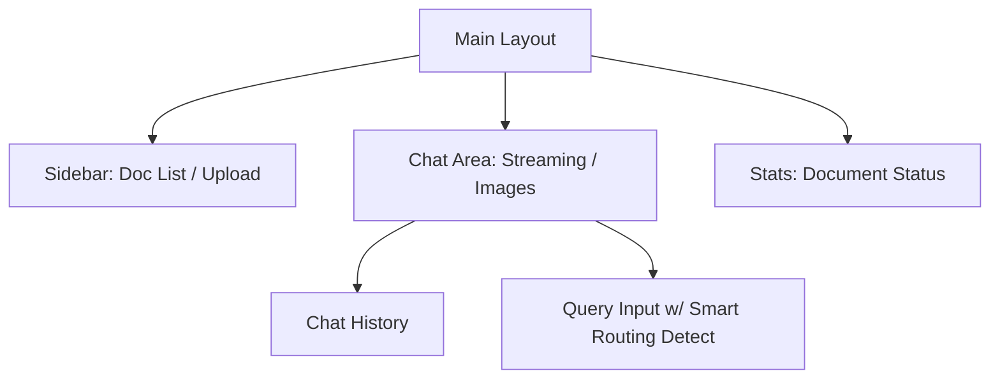

# 🎨 Multimodal RAG Frontend 설계 문서

본 문서는 멀티모달 RAG 서버의 모든 기능을 사용자 친화적이고 프리미엄한 UI로 제공하기 위한 프론트엔드 설계안입니다.

## 1. 프로젝트 개요
- **목적**: PDF 업로드, 상태 모니터링, 멀티모달 채팅, 문서 관리 기능을 통합한 웹 인터페이스 구축.
- **핵심 가치**: 시각적 탁월함(Aesthetics), 실시간 반응성(Streaming), 직관적인 데이터 관리.

## 2. 기술 스택 (Tech Stack)
- **Framework**: `Next.js 14+ (App Router)` - 서버 사이드 렌더링 및 최적화된 라우팅.
- **Styling**: `Vanilla CSS` 또는 `CSS Modules` - 고도로 커스터마이징된 독창적 디자인.
- **State Management**: `Zustand` - 가볍고 직관적인 상태 관리.
- **Icons**: `Lucide React` - 깔끔하고 현대적인 아이콘 세트.
- **Animations**: `Framer Motion` - 부드러운 전환 및 인터랙션 효과.
- **Real-time**: `Native WebSocket API` - 스트리밍 답변 연동.

## 3. 주요 기능 UI/UX 설계

### A. 대시보드 (Dashboard)
- **Glassmorphism 카드**: 전체 인덱싱된 문서 수, 최근 질문 수 등을 요약 표시.
- **문서 목록 (`GET /documents`)**: 카드형 레이아웃으로 문서 관리 및 삭제 기능 제공.

### B. 스마트 인제스트 (Ingest)
- **드래그 앤 드롭 업로드**: PDF 파일 드롭 시 즉각적인 시각 피드백.
- **실시간 프로그레스 바**: `GET /ingest/status`와 연동하여 백그라운드 작업 진행률을 부드러운 애니메이션으로 표시.

### C. 멀티모달 채팅 인터페이스 (Main QA)
- **다크 모드 베이스**: 눈이 편안한 딥 블루/그레이 톤의 프리미엄 테마.
- **스트리밍 버블**: 답변이 실시간으로 생성되는 타이핑 효과.
* **스마트 라우팅 뱃지**: 질문 내 페이지 번호 감지 시 "페이지 필터링 활성" 시각적 피드백 제공.
- **이미지 갤러리**: 답변 하단에 근거 이미지(Thumbnail)를 라이트박스 형태로 노출.

### D. 피드백 루프
- **인라인 피드백**: 답변 우측 하단에 👍/👎 버튼 배치 및 즉각적인 토스트 알림.

## 4. 정보 구조 (IA)

## 5. 디자인 원칙
1. **리치 에스테틱**: 단순한 흰색 배경 지양. 미세한 그라데이션과 부드러운 그림자 사용.
2. **반응성**: 모바일 및 태블릿 환경에서도 최적화된 레이아웃 제공.
3. **마이크로 애니메이션**: 버튼 호버, 문서 삭제 시의 리스트 리플로우 등에 세밀한 애니메이션 적용.

## 6. API 연동 로드맵
1. **Auth**: `X-API-Key` 헤더 공통 설정.
2. **Core**: `/qa`, `/ws/qa` 연동 (스트리밍 우선).
3. **Management**: `/ingest`, `/documents` 통합 관리 화면.
4. **Feedback**: `/feedback` 연동.
