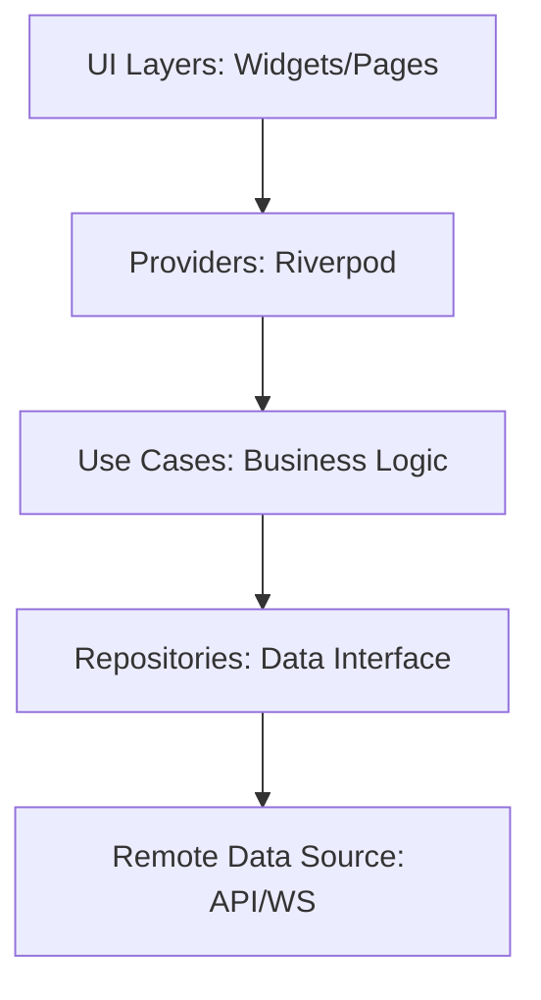

# 🎨 Multimodal RAG Flutter Frontend 설계 문서

본 문서는 멀티모달 RAG 서버의 모든 기능을 사용자 친화적인 **Flutter** 인터페이스로 구현하기 위한 설계안입니다.

## 1. 프로젝트 개요
- **목적**: macOS 기반 Flutter 앱을 통해 PDF 업로드, 상태 모니터링, 멀티모달 채팅 기능을 통합 제공.
- **핵심 기술**: **Flutter**, **Dart**, **Riverpod Generator**.
- **핵심 가치**: 프리미엄 UI/UX, 강력한 상태 관리, 스트리밍 인터랙션.

## 2. 프론트엔드 아키텍처 (Clean Architecture)

## 3. 기술 스택 및 라이브러리
- **State Management**: `flutter_riverpod` + `riverpod_generator` (컴파일 타임 안전성 확보).
- **Networking**: `dio` (HTTP 클라이언트), `web_socket_channel` (실시간 스트리밍).
- **UI & UX**:
  - `flutter_spinkit`: 고급 로딩 애니메이션.
  - `glass_kit` 또는 `Custom Painter`: Glassmorphism 효과 구현.
  - `cached_network_image`: 멀티모달 근거 이미지 캐싱.
  - `file_picker`: macOS 시스템 파일 선택기 연동.
- **Serialization**: `json_serializable` + `freezed` (모든 API 응답 타입 안정성 확보).

## 4. 핵심 기능 UI/UX 설계

### A. Dashboard & Document Management
*   **Grid Layout**: 반응형 2열 그리드 (`SliverGrid`) 기반의 문서 관리.
*   **Stitch Cards**: 상태 인디케이터와 토글 스위치가 포함된 모던 카드 UI.
*   **Docked Navigation**: 화면 하단에 고정된 네비게이션 바를 통해 메뉴 이동.

### B. Intelligent Ingest (업로드)
- **File Dropper**: PDF 파일을 앱으로 드래그할 때 시각적 피드백 제공.
- **Real-time Progress (Riverpod AsyncValue)**: `GET /ingest/status`를 폴링하거나 스트림으로 변환하여 진행률 애니메이션 처리.

### C. Multimodal Chat (QA)
*   **Split Layout**: 좌측 사이드바(채팅 기록)와 우측 메인 채팅 영억으로 분리된 데스크톱 최적화 구조.
*   **Streaming Bubble**: WebSocket을 통해 들어오는 청크 데이터를 실시간 반영.
*   **Multimodal Viewer**: 답변에 포함된 이미지 경로를 썸네일로 노출하고 클릭 시 확대.
*   **Collapsible Sidebar**: 채팅 기록 사이드바를 접거나 펼쳐서 작업 공간 확보 가능.

### D. Feedback & Logging
- **Simple Rating**: ListTile 하단에 긍정/부정 아이콘 배치.
- **Trace ID 관리**: Riverpod 상태 내에서 마지막 응답의 `trace_id`를 유지하여 피드백 전송 연동.

## 5. 디자인 원칙
1. **Dynamic Animations**: 프리미엄 앱 느낌을 위해 `Hero` 애니메이션과 리스트 전환 효과 필수 적용.
2. **Type Safety First**: 모든 API 요청/응답은 Dart 클래스로 변환하여 런타임 에러 방지.
3. **Responsive Design**: macOS 데스크톱 환경에 최적화된 넓은 뷰포트 활용.

## 6. 개발 로드맵
1. **Setup**: Flutter macOS 프로젝트 생성 및 basic dependencies 환경 구성.
2. **Data Model**: `freezed`를 사용하여 API 모델 클래스 생성.
3. **Providers**: Riverpod 기반의 Auth, Document, Chat 프로바이더 작성.
4. **UI Implementation**: 대시보드 -> 업로드 -> 채팅 순으로 프리미엄 UI 적용.
