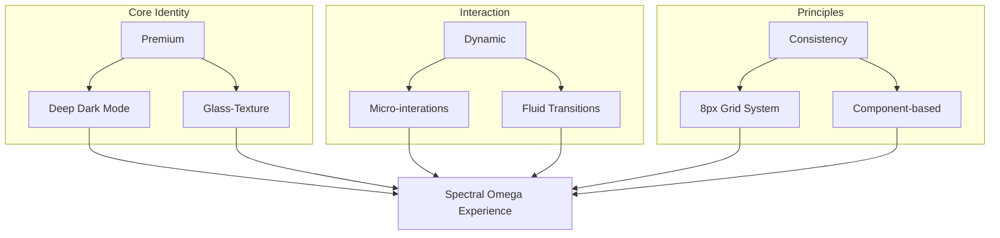

# 💎 Design Identity & Rules: [Spectral Omega]

사용자님의 프로젝트를 위한 프리미엄 디자인 가이드라인입니다. 모든 Flutter UI 컴포넌트는 이 규칙을 기반으로 생성됩니다.

## 1. Color Palette (Sophisticated Dark Mode)
단순한 검정색이 아닌, 깊이감 있는 **Deep Navy**와 세련된 **Accent** 컬러를 사용합니다.
- **Primary Background**: `#0F172A` (Deep Slate Navy) - 차분하고 고급스러운 배경
- **Surface (Glass)**: `rgba(255, 255, 255, 0.05)` ~ `0.15` - 유리 질감 레이어
- **Accent (Point)**: `#6366F1` (Indigo) & `#A855F7` (Purple) - 지적인 느낌의 그라데이션
- **Text Primary**: `#F8FAFC` (Cool White) - 높은 가독성
- **Text Secondary**: `#94A3B8` (Muted Blue-Gray) - 보조 설명용

## 2. Glassmorphism Design Rules
- **Blur Strength**: `SigmaX: 15.0, SigmaY: 15.0`을 표준으로 합니다.
- **Border**: `0.5px` 두께의 `rgba(255, 255, 255, 0.2)` 테두리를 적용하여 '유리 단면'의 날카로움을 표현합니다.
- **Shadow**: 그림자는 최소화하거나, 매우 넓고 은은하게(`Spread: 0, Blur: 40, Opacity: 0.1`) 사용하여 떠 있는 느낌만 줍니다.

## 3. Typography (Modern & Clean)
- **Main Font**: `Google Fonts: Inter` 또는 `Outfit` - 기하학적이고 현대적인 산세리프체
- **Hierarchy**:
  - `H1 (Title)`: Bold, Size 32, Letter Spacing -0.5
  - `Body`: Medium/Regular, Size 16, Line Height 1.5
  - `Caption`: Regular, Size 12, Opacity 0.7

## 4. Dynamic Animation Principles (The "Living" Logic)
- **Curve**: `Curves.outBack` (살짝 튕기는 느낌) 또는 `Curves.easeInOutCubic` (매끄러운 느낌) 사용.
- **Duration**: 
  - Micro-interactions: `200ms`
  - Page Transitions: `400ms ~ 600ms`
- **Hero**: 핵심 이미지나 카드가 전환될 때 반드시 `Hero` 위젯을 사용하여 시각적 연속성을 보장합니다.

## 5. Functional Aesthetics (Vibe Coding Friendly)
- **No Placeholders**: 이미지 필요 시 `generate_image` 툴을 사용한 고퀄리티 에셋 사용.
- **Spacing**: `8px` 배수 시스템을 사용하여 레이아웃의 안정성을 확보합니다.
- **Consistency**: 모든 버튼과 카드는 `BorderRadius.circular(24)`를 표준으로 하여 부드러운 인상을 줍니다.

---

## 🗺️ Design Rule Map

