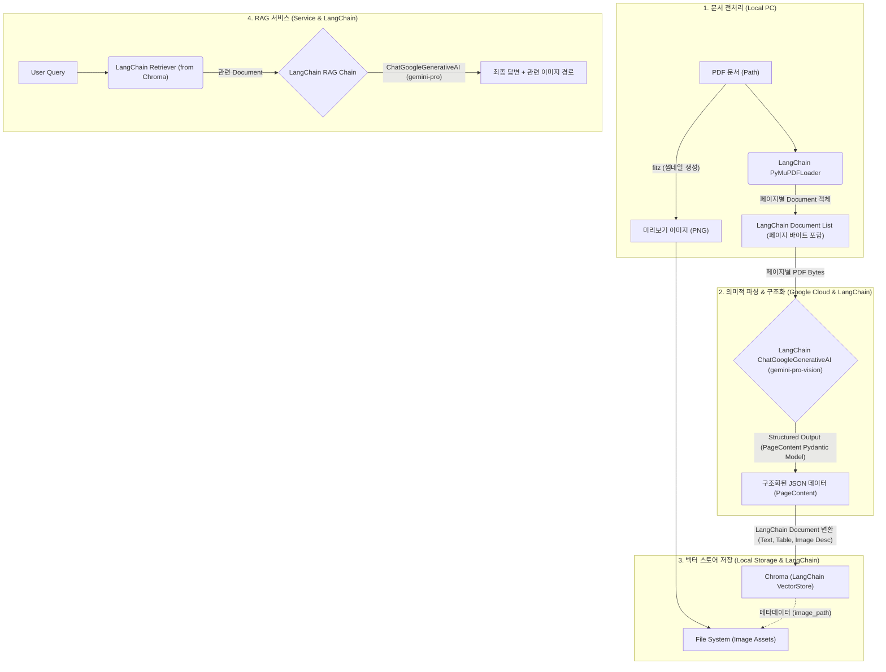

# 📄 Low-Resource Multimodal RAG System Design Document

**Version:** 2.2 (Final: PDF Direct + Semantic Tagging)
**Date:** 2025-12-09
**Author:** 최봉구

---

## 1. 프로젝트 개요 (Executive Summary)

본 프로젝트는 고사양 GPU 없이도 PDF 문서 내의 **텍스트, 표(Table), 이미지(Chart/Diagram)**를 완벽하게 인식하고 검색할 수 있는 RAG 시스템 구축을 목표로 한다.

이미지 변환 후 OCR을 수행하는 기존 방식을 버리고, **PDF 페이지를 직접 분할하여 전송**함으로써 벡터 정보를 보존한다. 또한, 복잡한 전처리 없이 Gemini 2.5의 추론 능력을 활용하여 **문서의 논리적 구조(챕터/섹션)를 자동으로 태깅**하는 "Physical Splitting + Semantic Tagging" 전략을 채택한다.

### 1.1 핵심 목표

- **Zero Local Compute:** 파싱, 임베딩, 추론 등 모든 고부하 작업을 Google Cloud API로 위임.
- **High Fidelity:** PDF 원본 직접 분석으로 텍스트 및 표 구조 완벽 보존.
- **Context-Aware:** 페이지 단위로 처리하되, AI가 추출한 챕터 정보를 메타데이터로 부여하여 문맥 유지.

---

## 2. 시스템 아키텍처 (System Architecture)

전체 시스템은 **LangChain 기반의 '문서 로드 -> 의미적 파싱 -> 클라우드 임베딩 -> 벡터 스토어 저장 -> 검색 및 답변 생성'** 파이프라인으로 구성된다.



---

## 3. 데이터 파이프라인 상세 (Data Pipeline)

### 3.1 Ingestion Layer (데이터 적재)

PDF를 처리하여 벡터 스토어에 넣는 과정은 LangChain의 구성요소를 활용하여 효율적이고 구조적으로 처리된다.

- **Document Loading & Page Splitting (LangChain PyMuPDFLoader):** LangChain의 `PyMuPDFLoader`를 사용하여 PDF 파일을 로드하고, 각 페이지를 개별적인 `LangChain Document` 객체로 자동 분할한다. (벡터 데이터 보존)
- **Thumbnail Generation (PyMuPDF `fitz`):** 검색 결과 표시를 위해 원본 PDF `fitz.Document`를 사용하여 각 페이지의 썸네일 이미지(PNG)를 생성하여 저장한다.
- **Vision Parsing (LangChain ChatGoogleGenerativeAI):** 각 `LangChain Document` (페이지)의 원본 PDF 바이트를 `ChatGoogleGenerativeAI` (`gemini-pro-vision` 모델)에 전송하여 멀티모달 파싱을 수행한다. `with_structured_output(PageContent)` 기능을 통해 **현재 페이지가 속한 챕터 정보 (`chapter_path`)를 포함하는 `PageContent` Pydantic 모델**로 구조화된 JSON 데이터를 추출한다.
  - **Input:** Single Page PDF Bytes (from `LangChain Document`)
  - **Prompt:** "텍스트, 표(Markdown), 이미지(상세 묘사)를 추출하라. **추가로, 이 내용이 속한 문서의 챕터/섹션 제목을 파악하여 `chapter_path` 필드에 명시하라.**"
  - **Output Format (Pydantic Model):** `src/parsing/schema.py`에 정의된 `PageContent` 스키마를 따른다.
- **Indexing (LangChain Chroma & Google Generative AI Embeddings):** 파싱된 `PageContent` 데이터를 텍스트, 테이블, 이미지 설명 등 의미 단위로 `LangChain Document` 객체 리스트로 변환한다. 이 `Document` 객체들은 `GoogleGenerativeAIEmbeddings`를 사용하여 벡터화된 후 `LangChain Chroma` 벡터 스토어에 저장된다. 각 `Document`의 `metadata`에는 `image_path` 및 기타 관련 정보가 포함된다.

### 3.2 Retrieval Layer (검색 및 생성)

사용자 질문에 대해 LangChain RAG 체인을 통해 가장 적절한 정보를 검색하고 답변을 생성한다.

- **Retriever Initialization (LangChain Chroma.as_retriever):** `LangChain Chroma` 벡터 스토어로부터 `BaseRetriever` 객체를 초기화한다. `GoogleGenerativeAIEmbeddings`가 내부적으로 사용되어 사용자 질문을 벡터화하고 유사한 문서를 검색한다.
- **RAG Chain (LangChain Expression Language - LCEL):** 검색된 `LangChain Document` 객체들(컨텍스트)과 사용자 질문을 `ChatPromptTemplate`을 통해 `ChatGoogleGenerativeAI` (`gemini-pro` 모델)에 전달하여 답변을 생성하는 RAG 체인이 LCEL로 구성된다.
  - **Context Formatting:** 검색된 `Document` 객체들의 `page_content`를 `format_docs` 함수를 사용하여 단일 문자열 컨텍스트로 결합한다.
  - **Image Path Extraction:** 검색된 `Document`들의 `metadata`에서 `image_path`를 추출하여 최종 답변에 포함한다.
- **Response Generation:** LLM이 생성한 답변과 함께 추출된 **관련 이미지 경로(`image_paths`)**를 반환하여, 답변 생성 시 이미지 참조 및 UI 표시에 활용될 수 있도록 한다.


---

## 4. 데이터 스키마 설계 (Database Schema)

ChromaDB의 단일 컬렉션(`manual_rag`) 내에서 `metadata`를 통해 데이터 타입을 구분하는 Multi-Vector Schema를 적용한다.

| 필드 (Field) | 데이터 타입 | 설명 (Description) |
| :--- | :--- | :--- |
| `ID` | String | `doc_name_p{page}_{type}_{index}` (예: `manual_p5_table_0`) |
| `Document` | String (Text) | 임베딩 및 검색의 대상이 되는 실제 내용.<br>- Text: 본문 내용<br>- Table: Markdown 문자열<br>- Image: Gemini가 생성한 '상세 묘사(Description)' |
| `Metadata` | Dictionary | - `source`: 파일명<br>- `page`: 페이지 번호<br>- `chapter_path`: **(New) AI가 추출한 챕터 경로 (예: "2.1 설치")**<br>- `type`: "text" / "table" / "image"<br>- `image_path`: 로컬에 저장된 **썸네일 이미지** 경로 |
| `Embedding` | Vector | Google GenAI API를 통해 생성된 벡터값 |

---

## 5. 기술 스택 (Tech Stack)

저사양 환경 최적화를 위해 **LangChain 기반의 100% 클라우드 오프로딩** 구성을 채택한다.

| 구분 | 기술/도구 | 선정 이유 |
| :--- | :--- | :--- |
| Language | Python 3.10+ | 최신 비동기 처리 및 라이브러리 호환성 |
| Framework | **LangChain (LCEL)** | LLM 애플리케이션 개발 표준 프레임워크, 모듈화 및 확장성, 빠른 개발 |
| PDF Loader | **LangChain PyMuPDFLoader** | PDF 문서를 LangChain `Document` 객체로 효율적으로 로드 |
| PDF Engine (Thumbnail) | PyMuPDF (fitz) | 썸네일 생성 등 세부 PDF 조작에 사용 |
| Multimodal Parser | **LangChain ChatGoogleGenerativeAI (gemini-pro-vision)** | PDF 직접 파싱, Pydantic `PageContent` 모델로 구조화된 출력, 논리적 구조(Chapter) 추론 능력 활용 |
| Embedding | **LangChain GoogleGenerativeAIEmbeddings** | **로컬 리소스 소모 0**, Gemini 모델과의 높은 의미적 호환성, LangChain 통합 |
| Vector DB | **LangChain Chroma** | 서버 설치 불필요, 로컬 파일 기반(Persistent) 저장, LangChain 통합 |
| LLM (Retrieval) | **LangChain ChatGoogleGenerativeAI (gemini-pro)** | RAG 체인 내에서 답변 생성, 긴 컨텍스트 윈도우, 저렴한 비용, 높은 한국어 성능 |

---

## 6. 성능 최적화 전략 (Performance Tuning)

- **Hybrid Processing:**
  - 파일 처리는 단순하고 빠른 '물리적 분할'을 사용하고, 복잡한 '논리적 구조 파악'은 똑똑한 Gemini에게 맡겨 효율을 극대화한다.
- **API 중심 설계:**
  - 임베딩까지 API로 전환하여 CPU/RAM 부하를 최소화한다.
- **썸네일 최적화:**
  - UI 표시용 이미지는 WebP 형식 등으로 변환하여 스토리지 용량을 절약한다.

---

## 7. 향후 확장 계획 (Roadmap)

- **Phase 1:** PDF 단일 문서 RAG 구축 (현재 목표)
- **Phase 2:** Streamlit을 이용한 채팅 UI 개발 (이미지 팝업 기능 포함)
- **Phase 3:** 대용량 문서 처리를 위한 배치(Batch) 처리 시스템 도입

---

## 8. 프로젝트 디렉토리 구조 (Directory Structure)

LangChain 기반의 모듈화된 아키텍처와 유지보수성, 모듈 재사용성을 고려하여 `src` 폴더 내에 기능을 분리한다.

```text
Multimodal_RAG/
├── .env                  # 환경 변수 (Google API Key 등)
├── .gitignore            # Git 제외 파일 목록 (chroma_db, assets, .env)
├── To_do_list.md         # 프로젝트 진행 상황 관리
├── 개발설계문서.md       # 시스템 설계 문서
├── main.py               # 프로그램 실행 진입점 (CLI 메뉴)
├── src/                  # 소스 코드 모듈
│   ├── __init__.py
│   ├── parsing/          # 파싱 모듈 (멀티모달 LLM을 이용한 PDF 페이지 구조화)
│   │   ├── __init__.py
│   │   ├── schema.py     # Pydantic 데이터 모델 (PageContent, Image 등)
│   │   └── parser.py     # LangChain ChatGoogleGenerativeAI를 이용한 페이지 파싱 로직
│   ├── preprocessing/    # 전처리 모듈 (PDF 로드, 썸네일 생성)
│   │   ├── __init__.py
│   │   ├── loader.py     # LangChain PyMuPDFLoader를 이용한 PDF 문서 로드
│   │   └── thumbnail.py  # PDF 썸네일 이미지 생성
│   ├── retrieval/        # 검색 및 생성 모듈 (질문 임베딩, 유사 문서 검색, 답변 생성)
│   │   ├── __init__.py
│   │   ├── retriever.py  # LangChain Retriever 초기화 및 구성
│   │   └── generator.py  # LangChain LCEL 기반 RAG 체인 구성 및 답변 생성
│   └── storage/          # 저장소 모듈 (Chroma 벡터 스토어 관리)
│       ├── __init__.py
│       └── vector_db.py  # LangChain Chroma 벡터 스토어 연결 및 데이터 적재
├── assets/               # 정적 파일 저장소
│   └── images/           # 생성된 썸네일 이미지 파일 (*.png)
└── chroma_db/            # [Auto-Generated] ChromaDB 벡터 데이터 저장 폴더
    └── ... (sqlite3 db file)
```
