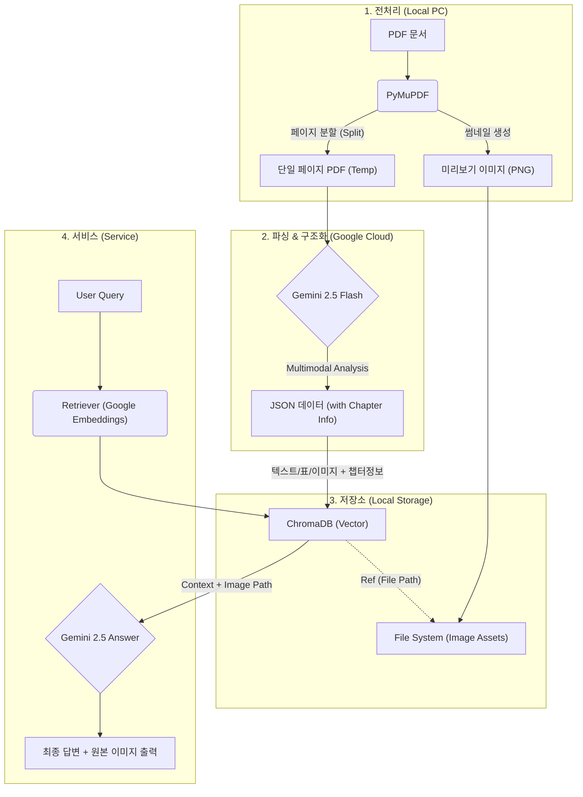

# 📄 Low-Resource Multimodal RAG System Design Document

**Version:** 2.2 (Final: PDF Direct + Semantic Tagging)
**Date:** 2025-12-09
**Author:** 최봉구

---

## 1. 프로젝트 개요 (Executive Summary)

본 프로젝트는 고사양 GPU 없이도 PDF 문서 내의 **텍스트, 표(Table), 이미지(Chart/Diagram)**를 완벽하게 인식하고 검색할 수 있는 RAG 시스템 구축을 목표로 한다.

이미지 변환 후 OCR을 수행하는 기존 방식을 버리고, **PDF 페이지를 직접 분할하여 전송**함으로써 벡터 정보를 보존한다. 또한, 복잡한 전처리 없이 Gemini 2.5의 추론 능력을 활용하여 **문서의 논리적 구조(챕터/섹션)를 자동으로 태깅**하는 "Physical Splitting + Semantic Tagging" 전략을 채택한다.

### 1.1 핵심 목표

- **Zero Local Compute:** 파싱, 임베딩, 추론 등 모든 고부하 작업을 Google Cloud API로 위임.
- **High Fidelity:** PDF 원본 직접 분석으로 텍스트 및 표 구조 완벽 보존.
- **Context-Aware:** 페이지 단위로 처리하되, AI가 추출한 챕터 정보를 메타데이터로 부여하여 문맥 유지.

---

## 2. 시스템 아키텍처 (System Architecture)

전체 시스템은 **'물리적 분할 -> 의미적 파싱 -> 클라우드 임베딩 -> 검색'**의 4단계 파이프라인으로 구성된다.



---

## 3. 데이터 파이프라인 상세 (Data Pipeline)

### 3.1 Ingestion Layer (데이터 적재)

PDF를 처리하여 DB에 넣는 과정은 **'물리적 페이지 단위'**로 단순화하여 속도를 높이고, 논리적 구조는 AI가 후처리한다.

- **Page Splitting:** PyMuPDF를 사용하여 원본 PDF를 1페이지짜리 개별 PDF 파일들로 분리한다. (벡터 데이터 보존)
- **Thumbnail Generation:** 검색 결과 표시를 위해 별도로 각 페이지의 썸네일 이미지(PNG)를 생성하여 저장한다.
- **Vision Parsing (Gemini 2.5):** 분할된 PDF 파일을 API에 전송한다. 이때 **현재 페이지가 속한 챕터 정보**를 함께 추출하도록 지시한다.
  - **Input:** Single Page PDF
  - **Prompt:** "텍스트, 표(Markdown), 이미지(상세 묘사)를 추출하라. **추가로, 이 내용이 속한 문서의 챕터/섹션 제목을 파악하여 `chapter_path` 필드에 명시하라.**"
  - **Output Format (JSON):**
    ```json
    {
      "chapter_path": "2. 엔진 구조 > 2.1 실린더 블록",
      "text_blocks": ["..."],
      "tables": ["| Header |..."],
      "images_desc": ["Figure 1. 회로도 설명..."]
    }
    ```
- **Indexing:** 파싱된 데이터를 유형별로 분류한다. **Google GenAI Embeddings** API를 호출하여 벡터화한 후 ChromaDB에 저장한다.

### 3.2 Retrieval Layer (검색 및 생성)

사용자 질문에 대해 가장 적절한 정보를 찾는 전략이다.

- **Query Embedding:** 사용자 질문을 **Google GenAI Embeddings** API를 통해 벡터화한다.
- **Hybrid Search:**
  - **의미 검색 (Semantic):** 질문과 유사한 텍스트/표/이미지 묘사를 찾는다.
  - **(옵션) 메타데이터 필터링:** 필요 시 추출된 `chapter_path`를 이용하여 특정 챕터 내에서만 검색할 수도 있다.
- **Response Generation:**
  - LLM에게 검색된 내용과 함께 **이미지 경로(`image_path`)**를 제공하여, 답변 생성 시 이미지를 참조하거나 UI에 띄우도록 한다.

---

## 4. 데이터 스키마 설계 (Database Schema)

ChromaDB의 단일 컬렉션(`manual_rag`) 내에서 `metadata`를 통해 데이터 타입을 구분하는 Multi-Vector Schema를 적용한다.

| 필드 (Field) | 데이터 타입 | 설명 (Description) |
| :--- | :--- | :--- |
| `ID` | String | `doc_name_p{page}_{type}_{index}` (예: `manual_p5_table_0`) |
| `Document` | String (Text) | 임베딩 및 검색의 대상이 되는 실제 내용.<br>- Text: 본문 내용<br>- Table: Markdown 문자열<br>- Image: Gemini가 생성한 '상세 묘사(Description)' |
| `Metadata` | Dictionary | - `source`: 파일명<br>- `page`: 페이지 번호<br>- `chapter_path`: **(New) AI가 추출한 챕터 경로 (예: "2.1 설치")**<br>- `type`: "text" / "table" / "image"<br>- `image_path`: 로컬에 저장된 **썸네일 이미지** 경로 |
| `Embedding` | Vector | Google GenAI API를 통해 생성된 벡터값 |

---

## 5. 기술 스택 (Tech Stack)

저사양 환경 최적화를 위해 **100% 클라우드 오프로딩** 구성을 채택한다.

| 구분 | 기술/도구 | 선정 이유 |
| :--- | :--- | :--- |
| Language | Python 3.10+ | 최신 비동기 처리 및 라이브러리 호환성 |
| PDF Engine | PyMuPDF (fitz) | PDF 분할 및 썸네일 생성 속도 최상 |
| Parser / OCR | Gemini 2.5 Flash | PDF 직접 파싱 + 논리적 구조(Chapter) 추론 능력 활용 |
| Embedding | **Google GenAI Embeddings** | **로컬 리소스 소모 0**, Gemini 모델과의 높은 의미적 호환성 |
| Vector DB | ChromaDB | 서버 설치 불필요, 로컬 파일 기반(Persistent) 저장 |
| LLM | Gemini 2.5 Flash | 긴 컨텍스트 윈도우, 저렴한 비용, 높은 한국어 성능 |

---

## 6. 성능 최적화 전략 (Performance Tuning)

- **Hybrid Processing:**
  - 파일 처리는 단순하고 빠른 '물리적 분할'을 사용하고, 복잡한 '논리적 구조 파악'은 똑똑한 Gemini에게 맡겨 효율을 극대화한다.
- **API 중심 설계:**
  - 임베딩까지 API로 전환하여 CPU/RAM 부하를 최소화한다.
- **썸네일 최적화:**
  - UI 표시용 이미지는 WebP 형식 등으로 변환하여 스토리지 용량을 절약한다.

---

## 7. 향후 확장 계획 (Roadmap)

- **Phase 1:** PDF 단일 문서 RAG 구축 (현재 목표)
- **Phase 2:** Streamlit을 이용한 채팅 UI 개발 (이미지 팝업 기능 포함)
- **Phase 3:** 대용량 문서 처리를 위한 배치(Batch) 처리 시스템 도입

---

## 8. 프로젝트 디렉토리 구조 (Directory Structure)

유지보수와 모듈 재사용성을 고려하여 기능을 `src` 폴더 내의 별도 파일로 분리하는 레이어드 아키텍처를 적용한다.

```text
Multimodal_RAG/
├── .env                  # 환경 변수 (Google API Key 등)
├── .gitignore            # Git 제외 파일 목록 (chroma_db, assets, .env)
├── To_do_list.md         # 프로젝트 진행 상황 관리
├── 개발설계문서.md       # 시스템 설계 문서
├── main.py               # 프로그램 실행 진입점 (CLI 메뉴)
├── src/                  # 소스 코드 모듈
│   ├── __init__.py
│   ├── preprocessor.py   # 전처리: PDF 로드, 페이지 분할, 썸네일 생성
│   ├── parser.py         # 파싱: Gemini API 연동, 멀티모달 데이터 추출
│   ├── storage.py        # 저장소: ChromaDB 연결, 데이터 적재(Indexing)
│   └── rag_engine.py     # 검색/생성: 질문 임베딩, 검색, 답변 생성
├── assets/               # 정적 파일 저장소
│   └── images/           # 생성된 썸네일 이미지 파일 (*.png)
└── chroma_db/            # [Auto-Generated] ChromaDB 벡터 데이터 저장 폴더
    └── ... (sqlite3 db file)
```
