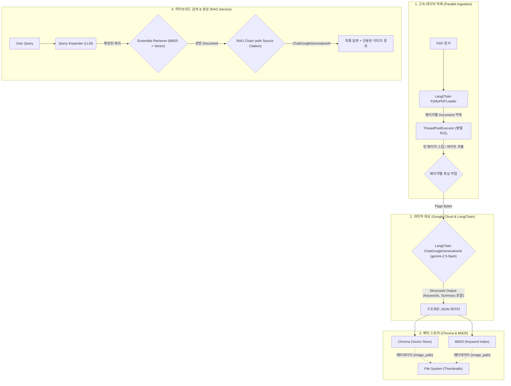

# 📄 Low-Resource Multimodal RAG System Design Document

**Version:** 3.0 (Performance Optimized & Hybrid Search)
**Date:** 2025-12-11
**Author:** 최봉구

---

## 1. 프로젝트 개요 (Executive Summary)

본 프로젝트는 고사양 GPU 없이도 PDF 문서 내의 **텍스트, 표(Table), 이미지(Chart/Diagram)**를 완벽하게 인식하고 검색할 수 있는 RAG 시스템 구축을 목표로 한다.

이미지 변환 후 OCR을 수행하는 기존 방식을 버리고, **PDF 페이지를 직접 분할하여 전송**함으로써 벡터 정보를 보존한다. 또한, 복잡한 전처리 없이 Gemini 2.5의 추론 능력을 활용하여 **문서의 논리적 구조(챕터/섹션)를 자동으로 태깅**하는 "Physical Splitting + Semantic Tagging" 전략을 채택한다.

### 1.1 핵심 목표

- **Zero Local Compute:** 파싱, 임베딩, 추론 등 모든 고부하 작업을 Google Cloud API로 위임.
- **High Fidelity:** PDF 원본 직접 분석으로 텍스트 및 표 구조 완벽 보존.
- **Context-Aware:** 페이지 단위로 처리하되, AI가 추출한 챕터 정보를 메타데이터로 부여하여 문맥 유지.
- **High Performance:** 병렬 처리 및 쿼리 최적화를 통한 빠른 인덱싱 및 검색 속도 확보.

---

## 2. 시스템 아키텍처 (System Architecture)

전체 시스템은 **LangChain 기반의 '병렬 문서 로드 -> 의미적 파싱 -> 하이브리드 검색 -> 답변 생성 및 출처 인용'** 파이프라인으로 구성된다.

---

## 3. 데이터 파이프라인 상세 (Data Pipeline)

### 3.1 Ingestion Layer (데이터 적재)

속도와 안정성을 최적화한 병렬 처리 파이프라인을 구축한다.

- **Parallel Processing (concurrent.futures):** `ThreadPoolExecutor`를 도입하여 다수의 페이지를 동시에 파싱한다. (기본 50 Workers)
- **Smart Skip Logic:** 텍스트가 거의 없고(50자 미만) 이미지가 없는 페이지는 API 호출 없이 즉시 건너뛰어 비용과 시간을 절약한다.
- **Prompt Optimization:** 시스템 프롬프트를 경량화하여 토큰 사용량을 최소화하고 처리 속도를 높인다.
- **Robustness (Retry):** 지수 백오프(Exponential Backoff)가 적용된 재시도 로직을 통해 API 일시적 오류를 방어한다.
- **Vision Parsing:** `gemini-2.5-flash`를 사용하여 텍스트, 표, 이미지뿐만 아니라 **핵심 키워드(Keywords)와 요약(Summary)**을 추가로 추출하여 검색 품질을 높인다.

### 3.2 Retrieval Layer (검색 및 생성)

단순 벡터 검색의 한계를 극복하기 위해 하이브리드 검색 전략을 사용한다.

- **Hybrid Search (EnsembleRetriever):**
  - `BM25Retriever`: 정확한 키워드 매칭 (재현율 보장)
  - `VectorStoreRetriever`: 의미적 유사성 검색 (문맥 파악)
  - 위 두 검색기를 50:50 가중치로 결합하여 최적의 문서를 추출한다.
- **Query Expansion:** 사용자 질문을 LLM이 분석하여 검색에 유리한 형태(동의어, 기술 용어 포함)로 확장한 후 검색을 수행한다.
- **Source Citation (출처 인용):** RAG 체인에서 답변 생성 시, 참조한 이미지 경로를 명시적으로 인용(`[[Cited Images: ...]]`)하도록 하여 정확한 출처를 제공한다.

---

## 4. 데이터 스키마 설계 (Database Schema)

ChromaDB의 단일 컬렉션(`manual_rag`) 내에서 `metadata`를 통해 데이터 타입을 구분하는 Multi-Vector Schema를 적용한다.

| 필드 (Field) | 데이터 타입 | 설명 (Description) |
| :--- | :--- | :--- |
| `ID` | String | `doc_name_p{page}_{type}_{index}` (예: `manual_p5_table_0`) |
| `Document` | String (Text) | 임베딩 및 검색의 대상이 되는 실제 내용. - Text: 본문 내용 - Table: Markdown 문자열 - Image: Gemini가 생성한 '간결한 묘사(Brief Description)' |
| `Metadata` | Dictionary | - `source`: 파일명 - `page`: 페이지 번호 - `chapter_path`: 챕터 경로 - `keywords`: **(New) 핵심 키워드 리스트** - `summary`: **(New) 페이지 요약** - `image_path`: 썸네일 이미지 경로 |
| `Embedding` | Vector | Google GenAI API를 통해 생성된 벡터값 |

---

## 5. 기술 스택 (Tech Stack)

저사양 환경 최적화를 위해 **LangChain 기반의 100% 클라우드 오프로딩** 구성을 채택한다.

| 구분 | 기술/도구 | 선정 이유 |
| :--- | :--- | :--- |
| Language | Python 3.10+ | 최신 비동기 처리 및 라이브러리 호환성 |
| Framework | **LangChain (LCEL)** | LLM 애플리케이션 개발 표준 프레임워크 |
| Parallelism | **concurrent.futures** | 멀티스레딩을 통한 I/O 바운드 작업(API 호출) 가속화 |
| PDF Engine | PyMuPDF (fitz) | 고속 텍스트 추출 및 썸네일 생성 |
| Multimodal Parser | **LangChain ChatGoogleGenerativeAI (gemini-2.5-flash)** | 빠르고 저렴한 비용으로 고품질 멀티모달 파싱 수행 |
| Retrieval | **EnsembleRetriever (BM25 + Chroma)** | 키워드/의미 검색의 장점 결합 |
| Keyword Search | **rank_bm25** | 키워드 기반 검색 알고리즘 라이브러리 |
| Vector DB | **LangChain Chroma** | 서버 설치 불필요, 로컬 파일 기반(Persistent) 저장 |

---

## 6. 성능 최적화 전략 (Performance Tuning)

- **Parallel Ingestion:** 스레드 풀을 이용한 병렬 파싱으로 대량의 문서 적재 시간을 획기적으로 단축.
- **Prompt Diet:** 파싱 프롬프트를 최적화하여 토큰 비용 절감 및 응답 속도 향상.
- **Skip Logic:** 무의미한 페이지(빈 페이지 등)를 사전 필터링하여 API 호출 낭비 방지.
- **Image Source Citation:** 답변에 정확히 관련된 이미지만 보여주어 UX 개선 및 환각(Hallucination) 방지.

---

## 7. 향후 확장 계획 (Roadmap)

- **Phase 1:** PDF 단일 문서 RAG 구축 (완료)
- **Phase 2:** 성능 고도화 및 하이브리드 검색 도입 (완료)
- **Phase 3:** 검색 인덱스(BM25) 지속성 확보 및 채팅 UI 개발 (예정)

---

## 8. 프로젝트 디렉토리 구조 (Directory Structure)

*(기존 구조 유지)*

